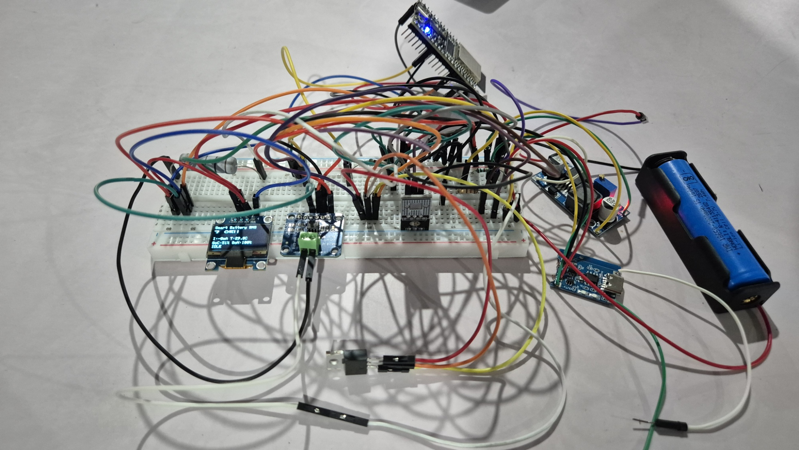
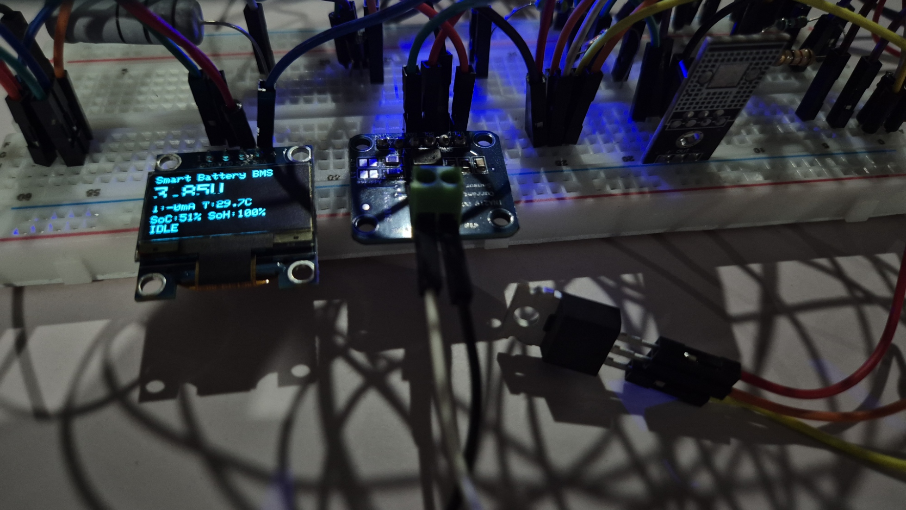
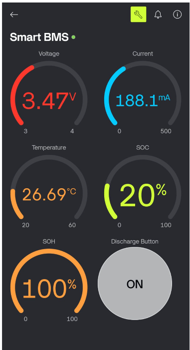

# 🔋 Smart Battery Management System (BMS)

A Smart Battery Management System built using ESP32 that monitors battery health in real-time. It tracks voltage, current, temperature, State of Charge (SoC), and State of Health (SoH) with IoT integration.

---

## 🚀 Features

- ⚡ Real-time voltage & current monitoring
- 🌡️ Temperature tracking with safety cutoff
- 🔋 State of Charge (SoC) estimation using OCV + Coulomb Counting
- ❤️ State of Health (SoH) calculation
- 📱 IoT dashboard using Blynk
- 📟 OLED display for live data
- 🔒 Safety shutdown (overcurrent, overheating)
- 🔌 Charging/Discharging detection

---

## 🛠️ Tech Stack

- **Microcontroller:** ESP32
- **Sensors:** INA219 (Current/Voltage), DS18B20 (Temperature)
- **Display:** OLED (SSD1306)
- **IoT Platform:** Blynk
- **Language:** Arduino (C++)

---

## ⚙️ Working

1. Reads voltage, current, and temperature data
2. Calculates SoC using:
   - Coulomb counting during discharge
   - OCV correction during idle/charging
3. Calculates SoH after full discharge cycle
4. Displays data on OLED and Blynk dashboard
5. Applies safety cutoff if limits exceed

---

## 📸 Project Images

### Hardware Setup

### OLED Output

### Blynk Dashboard

---

## 🔌 Circuit Components

- ESP32
- INA219 Sensor
- DS18B20 Temperature Sensor
- OLED Display
- MOSFET
- Battery

---

## ▶️ How to Run

1. Clone the repository
2. Open `.ino` file in Arduino IDE
3. Install required libraries:
   - Adafruit INA219
   - DallasTemperature
   - Adafruit SSD1306
   - Blynk

4. Update WiFi & Blynk credentials
5. Upload to ESP32

---

## 📊 Future Improvements

- ML-based battery health prediction
- Cloud data logging
- Mobile app UI improvements
- Multi-cell battery support

---

## 👩‍💻 Author

**Shriya Choksi**
